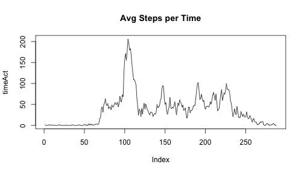
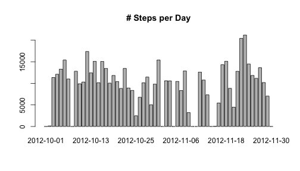
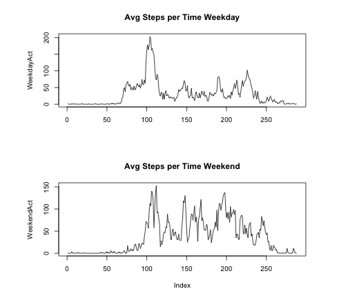

# Reproducible Research: Peer Assessment 1


## Loading and preprocessing the data


```r
setwd("/Users/thompson/RepData_PeerAssessment1/")
activity<-read.csv("activity.csv")
```

## What is mean total number of steps taken per day?


```r
StepsDay<-tapply(activity$steps,activity$date,sum)
barplot(StepsDay, main ="# Steps per Day")
```

 


```r
meanSteps<-mean(StepsDay,na.rm=TRUE)
medianSteps<-median(StepsDay, na.rm=TRUE)
```
The mean number of steps taken per day = 1.0766 &times; 10<sup>4</sup>
The median number of steps taken per day = 10765

## What is the average daily activity pattern?


```r
NaActivity<-na.omit(activity)
timeAct<-tapply(NaActivity$steps,NaActivity$interval,mean)
plot(timeAct,type="l", main="Avg Steps per Time")
```

 


```r
MaxInt<-which.max(timeAct)
names(MaxInt)
```

```
## [1] "835"
```
The 5 minute interval where average max number of steps are taken is 104

## Imputing missing values


```r
MissingVals<-sum(is.na(activity[,1]))
```
There are 2304 missing values.

Removing missing values

```r
activity[is.na(activity)]<-0
```

Calculating avg per date. Mean and median for all days

```r
StepsDay<-tapply(activity$steps,activity$date,sum)
barplot(StepsDay, main ="# Steps per Day")
```

 

```r
meanSteps<-mean(StepsDay)
medianSteps<-median(StepsDay)
```

The mean number of steps taken per day = 9354.2295
The median number of steps taken per day = 1.0395 &times; 10<sup>4</sup>

Replacing NA values with 0 reduced the mean and meadian number of steps.


## Are there differences in activity patterns between weekdays and weekends?

Determine if the date is a weekday or weekend

```r
df<-data.frame(activity[,2])
dates<-as.Date(df[,], format ="%Y-%m-%d")
activity[,2]<-dates
days<-weekdays(dates)

##too cludgy
days[days=="Monday"]<-"weekday"
days[days=="Tuesday"]<-"weekday"
days[days=="Wednesday"]<-"weekday"
days[days=="Thursday"]<-"weekday"
days[days=="Friday"]<-"weekday"
days[days=="Saturday"]<-"weekend"
days[days=="Sunday"]<-"weekend"

activity<-data.frame(activity,cbind(days))
sactivity<-split(activity,activity$days)
```


```r
weekendSteps<-sactivity$weekend[1]
weekendInterval<-sactivity$weekend[3]
WeekendAct<-tapply(weekendSteps$steps,weekendInterval$interval,mean)
#plot(WeekendAct,type="l", main="Avg Steps per Time Weekend")

weekdaySteps<-sactivity$weekday[1]
weekdayInterval<-sactivity$weekday[3]
WeekdayAct<-tapply(weekdaySteps$steps,weekdayInterval$interval,mean)

layout(matrix(c(1,1,2,2),2,2,byrow=TRUE), respect=TRUE)
plot(WeekdayAct,type="l", main="Avg Steps per Time Weekday", xlab="",sub="")
plot(WeekendAct,type="l", main="Avg Steps per Time Weekend")
```

 
